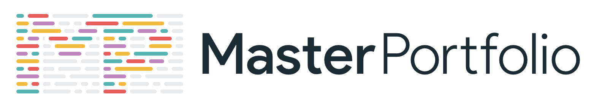
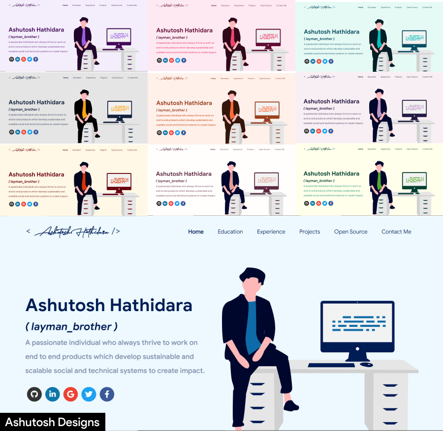

<p align="center">
    
</p>

<h1 align="center"> Software Developer Master Portfolio 🔥 </h1>
<h3 align="center">
    A clean and customizable React-based portfolio template for developers.
</h3>

<p align="center">
  <a href="https://nodejs.org/"></a>
  <a href="https://www.npmjs.com/"></a>
  <a href="https://reactjs.org/"></a>
  <a href="https://github.com/prettier/prettier"></a>
  <a href="http://badges.mit-license.org/"></a>
  <a href="https://img.shields.io/badge/price-free-ff69b4"></a>
</p>

<p align="center">
    If you want to discuss or get support, join the <a href="https://discord.com/invite/GkcbM5bwZr">Discord Server</a>.
</p>

<p align="center">
    <a href="https://ashutosh1919.github.io" target="_blank">
        
    </a>
</p>

:star: Star us on GitHub — it helps!

# Features

- Beautiful, minimal and mobile-friendly portfolio template.
- Fully customizable: update your information and sections in `src/portfolio.js`.
- Sections include: About, Skills, Projects, Experience, Certifications, Blog, Education, Contact, and Resume Viewer.
- Simple theming in `src/theme.js`.
- Easy deployment to Github Pages.

To view a live example, **[click here](https://ashutosh1919.github.io/)**

# Quick Start

1. Make sure you have [Node.js](https://nodejs.org/) and [npm](https://www.npmjs.com/) installed (see badges above for recommended versions).
2. Clone the repository:
   ```bash
   git clone https://github.com/abdulrehman705/abdulrehman-portfolio.git
   ```
3. Install dependencies:
   ```bash
   npm install
   ```
4. Start the development server:
   ```bash
   npm start
   ```
   Your portfolio will now be running locally.

# Customization

- Edit your portfolio details and sections in `src/portfolio.js`.
- Change the site title and metadata in `public/index.html`.
- For icons, you can use [Iconify](https://icon-sets.iconify.design/) or insert custom image files to `public/skills`.
- Change the color theme in `src/theme.js`.
- Add your resume PDF in `/src/assets/docs/`, update the import path in `/src/pages/resume/Resume.js`, and browse to `/resume` to see it.

# Splash Screen/Logo

- The splash logo is customizable via the `/src/components/Loader/` directory.
- To disable it, set `isSplash: false` in `src/portfolio.js` settings.

# Deployment

- Recommended: deploy using [Github Pages](https://create-react-app.dev/docs/deployment/#github-pages).
- Build your production-ready site:
   ```bash
   npm run build
   ```
- Push the `build` folder to your `<your-github-username>.github.io` repository on the `master` branch.
- Or use `npm run deploy` to push to the `gh-pages` branch and enable Github Pages in repository settings.

# Technologies Used

- [React](https://reactjs.org/)
- [GraphQL](https://graphql.org/)
- [Apollo Boost](https://www.apollographql.com/docs/react/get-started/)
- [BaseUI](https://github.com/uber/baseweb)
- [react-reveal](https://www.react-reveal.com/)
- [styled-components](https://styled-components.com/)

# Illustrations

- [UnDraw](https://undraw.co/illustrations)

# License

This project is licensed under the MIT License - see the [LICENSE.md](./LICENSE) file.

# Contributors ✨

<!-- ALL-CONTRIBUTORS-LIST:START - Do not remove or modify this section -->
<!-- prettier-ignore-start -->
<!-- markdownlint-disable -->
<table>
  <tbody>
  <!-- Contributor table intentionally left unchanged -->
  </tbody>
</table>
<!-- markdownlint-restore -->
<!-- prettier-ignore-end -->
<!-- ALL-CONTRIBUTORS-LIST:END -->

# References

- Based on and inspired by [Saad Pasta's Portfolio Project](https://github.com/saadpasta/developerFolio).
- Logo inspired by [prettier-logo](https://github.com/prettier/prettier-logo) by @ianstormtaylor.
